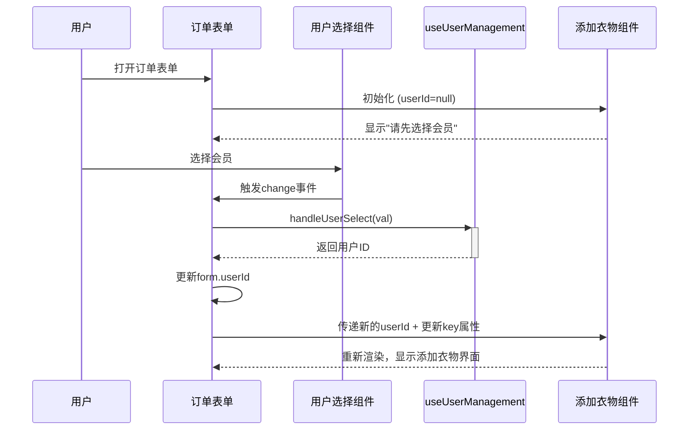

```mermaid
sequenceDiagram
    participant User as 用户
    participant Form as 订单表单
    participant UserSelect as 用户选择组件
    participant UserMgmt as useUserManagement
    participant AddCloth as 添加衣物组件
    
    User->>Form: 打开订单表单
    Form->>AddCloth: 初始化 (userId=null)
    AddCloth-->>Form: 显示"请先选择会员"
    
    User->>UserSelect: 选择会员
    UserSelect->>Form: 触发change事件
    Form->>+UserMgmt: handleUserSelect(val)
    UserMgmt-->>-Form: 返回用户ID
    Form->>Form: 更新form.userId
    Form->>AddCloth: 传递新的userId + 更新key属性
    AddCloth-->>Form: 重新渲染，显示添加衣物界面
```