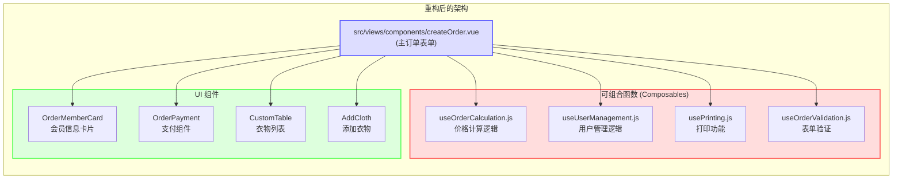

```mermaid
graph LR
    subgraph "重构后的架构"
        style MainForm fill:#ddf,stroke:#55f,stroke-width:2px
        style ComposableLayer fill:#fdd,stroke:#f55,stroke-width:2px
        style ComponentLayer fill:#dfd,stroke:#5f5,stroke-width:2px

        MainForm["src/views/components/createOrder.vue<br/>(主订单表单)"]

        subgraph ComposableLayer["可组合函数 (Composables)"]
            OrderCalc["useOrderCalculation.js<br/>价格计算逻辑"]
            UserMgmt["useUserManagement.js<br/>用户管理逻辑"]
            Printing["usePrinting.js<br/>打印功能"]
            Validation["useOrderValidation.js<br/>表单验证"]
        end

        subgraph ComponentLayer["UI 组件"]
            MemberCard["OrderMemberCard<br/>会员信息卡片"]
            Payment["OrderPayment<br/>支付组件"]
            CustomTable["CustomTable<br/>衣物列表"]
            AddCloth["AddCloth<br/>添加衣物"]
        end

        MainForm --> OrderCalc
        MainForm --> UserMgmt
        MainForm --> Printing
        MainForm --> Validation

        MainForm --> MemberCard
        MainForm --> Payment
        MainForm --> CustomTable
        MainForm --> AddCloth
    end
```